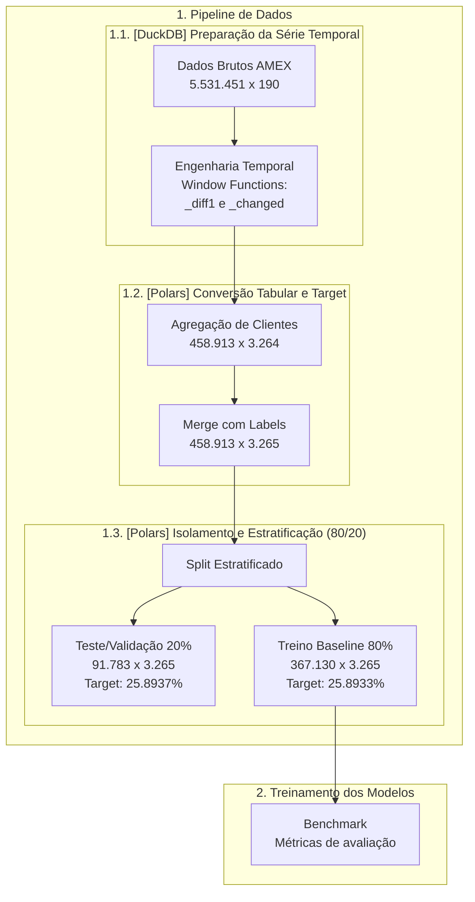

```mermaid
graph TD
    subgraph "1. Pipeline de Dados"
        subgraph "1.1. [DuckDB] Preparação da Série Temporal"
            RAW["Dados Brutos AMEX <br/>5.531.451 x 190"]
            FE["Engenharia Temporal <br/>Window Functions: <br/>_diff1 e _changed"]
        end

        subgraph "1.2. [Polars] Conversão Tabular e Target"
            AGG["Agregação de Clientes <br/>458.913 x 3.264"]
            MERGE["Merge com Labels <br/>458.913 x 3.265"]
        end

        subgraph "1.3. [Polars] Isolamento e Estratificação (80/20)"
            SPLIT["Split Estratificado"]
            TESTE["Teste/Validação 20% <br/>91.783 x 3.265 <br/>Target: 25.8937%"]
            TREINO["Treino Baseline 80% <br/>367.130 x 3.265 <br/>Target: 25.8933%"]
        end
    end

    subgraph "2. Treinamento dos Modelos"
        MODELS["Benchmark <br/>Métricas de avaliação"]
    end

    RAW --> FE
    FE --> AGG
    AGG --> MERGE
    MERGE --> SPLIT
    SPLIT --> TREINO
    SPLIT --> TESTE
    TREINO --> MODELS
```